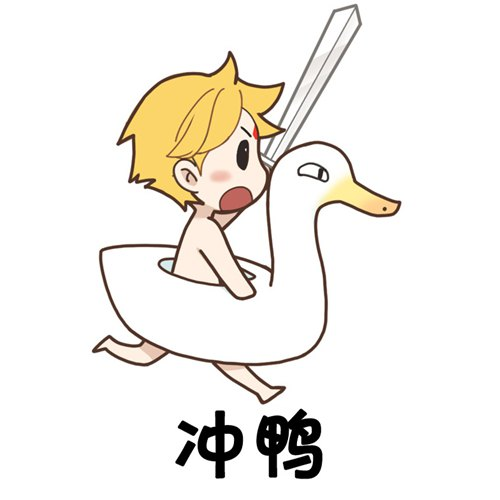

## BemibbsPHP Framework 1.0
安装:
```
composer create-project bemiou_lingqi/bemibbs bemi
```
## 功能特性
+ 插件引擎
+ 模板引擎
+ 路由功能
+ 自定义配置
>需要PHP版本7.0+

## 联系我们
<!--[官网](http://www.bemiou.cn/)
[社区](http://bbs.bemiou.cn/)
[博客](http://blog.bemiou.cn/)
[QQ群](https://jq.qq.com/?_wv=1027&k=dXo1Hqj1)-->
<a href="http://www.bemiou.cn/" target="_blank">官网</a>
<a href="http://bbs.bemiou.cn/" target="_blank">社区</a>
<a href="http://blog.bemiou.cn/" target="_blank">博客</a>
<a href="https://jq.qq.com/?_wv=1027&k=dXo1Hqj1" target="_blank">QQ群</a>
## 版权
Copyright &copy; 2021-2022 <a href="http://www.bemiou.cn/" target="_blank">Bemiou Studio</a> All rights reserved